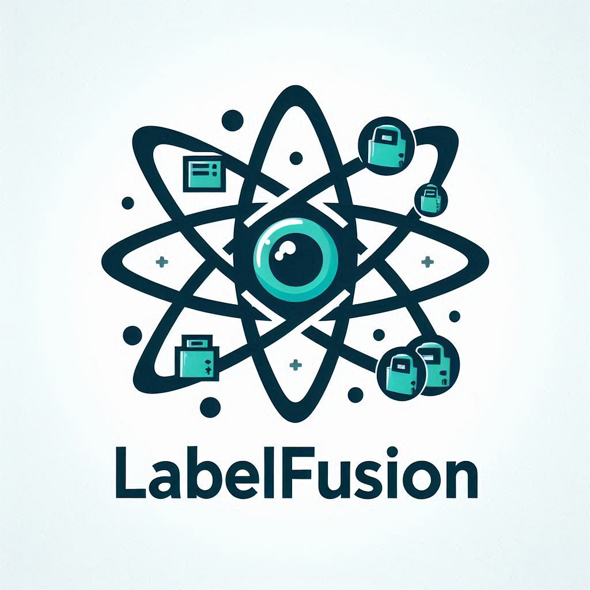

# Label Fusion

Combine multiple shipping label PDFs, including ones that may start with shipping labels, into one combined PDF to make it easier to print bulk shipments.

## How to Use

1. Click the "Choose Files" button to select which shipping label PDFs you wish to use.

    > Don't worry, these files are processed entirely in your browser and aren't uploaded anywhere

1. Click the "Generate" button. The last page of all the PDF's you selected in Step 1 will be combined into a new PDF file you can either download or print from your browser.
